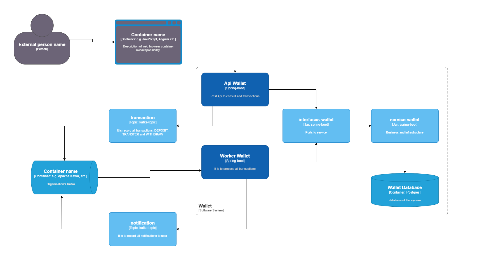

# Worker Wallet Project

## Overview

This project consists of a distributed application developed using **Spring Boot**, **Kafka**, and **Keycloak**. Its primary goal is to securely manage financial transactions with support for notifications and storage in a relational database.

The architecture is event-driven, where transactions are processed asynchronously using **Apache Kafka** and Avro serialization to ensure consistency and scalability.

---
## Sequence



## Project Structure

### Modules
- **API Wallet**: REST interface exposing endpoints to manage transactions and communicate with Keycloak.
- **Worker Wallet**: Service responsible for consuming transaction messages from Kafka and processing them.
- **Keycloak**: Authentication and authorization service based on OAuth2 and OpenID Connect.

### Key Dependencies
- **Spring Kafka**: For producing and consuming events in Kafka.
- **Avro**: For binary message serialization.
- **Keycloak**: For authentication and permissions management.
- **PostgreSQL**: Database for information storage.

---

## How to Set Up the Project

### Prerequisites
- Docker and Docker Compose installed
- Maven installed to build the project locally
- JDK 17+

### Build and Run

1. **Environment Configuration**:

   Ensure the `.docker/.env` file is filled with the following variables:
   ```bash
   API_IMAGE_NAME=api-wallet
   API_IMAGE_VERSION=latest
   WORKER_IMAGE_NAME=worker-wallet
   WORKER_IMAGE_VERSION=latest ``` 

2.  **Hosts Settings**:

   ```
   192.168.1.73 keycloak
   192.168.1.73 grafana
   192.168.1.73 loki
   ```

   192.168.1.73 is the docker ip

3.  **Starting the Project**: Run the following command in the project root:
    
      `./build-and-run.sh` 
    

----------

## Available Services

### API Wallet

-   Default port: **8084**
-   Key Endpoints:
    -   `POST /v1/wallets/withdraws`: Creates a wallet.
    -   `GET /v1/wallets/balance`: Returns the wallet balance.
    -   `GET /v1/wallets/balance?dateHistory`: Returns the wallet balance for a specific date.
    -   `POST /v1/transactions/transfers`: Creates a transfer between wallets.
    -   `POST /v1/transactions/deposits`: Adds funds to a wallet.
    -   `POST /v1/transactions/withdraws`: Withdraws funds from a wallet.
    -   `GET /v1/transactions/`: Returns all transactions associated with the authenticated user.

The swagger file is in the root project: swaager.yml
### Worker Wallet

-   Default port: **8085**
-   Consumes messages from Kafka's transaction topic to process events asynchronously.

### Keycloak

-   Default port: **8080**
-   Manages user and service authentication and authorization.

----------

## Avro Message Structure

### Transaction


```
{
  "namespace": "com.recargapay.code.assessment.topics",
  "type": "record",
  "name": "Transaction",
  "fields": [
    { "name": "amount", "type": { "type": "bytes", "logicalType": "decimal", "precision": 20, "scale": 2 } },
    { "name": "relatedWalletId", "type": ["null", { "type": "string", "logicalType": "uuid" }], "default": null },
    { "name": "createdAt", "type": { "type": "long", "logicalType": "timestamp-millis" } },
    { "name": "walletId", "type": ["null", { "type": "string", "logicalType": "uuid" }], "default": null },
    { "name": "typeTransaction", "type": { "type": "string" } }
  ]
}
```

### Notification

```
{
  "type": "record",
  "name": "Notification",
  "namespace": "com.recargapay.code.assessment.topics",
  "fields": [
    { "name": "message", "type": "string" },
    { "name": "to", "type": "string" }
  ]
}
```

----------

## Database

### Configuration

-   **PostgreSQL**
    -   Default port: **5432**
    -   Default credentials:
        -   **User**: postgres
        -   **Password**: Postgres2022!

### Initialization

Scripts for schema creation and data population:

-   `ddl.sql`: Creates database tables.
-   `dml.sql`: Populates the database with initial test data.

----------

## Keycloak

### Information

-   **Admin Console**: `http://keycloak:8080/admin`
-   **Admin User**: admin
-   **Password**: admin

### Test Users

-   `pedro.costa`: Wallet owner.
-   `maria.melo`: Wallet owner.
-   pass: teste
----------

## Audit Logs and Monitoring

### Grafana

-   URL: `http://grafana:3000`
-   Application metrics monitoring.
- user: admin
- pass: admin

### Loki

-   Integrated with Grafana for log management.
- Add Datasource in Grafana's interface: http://loki:3100

### Uninstall

Execute this comman in root's project

`docker-compose -f ./.docker/docker-compose.yml down --volumes`